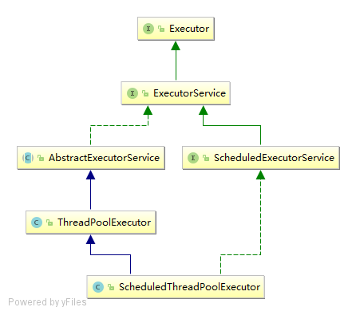

## 线程池的使用和实现原理：

<!-- more -->

Excetor框架有两个关键类实现了ExecutorService接口：
继承关系图如下：

> 虚线是implements，实线是extends。

### 1，ThreadPoolExecutor
它是线程池的实现类，主要有下列四个参数构成：
1. corePoolSize：核心线程池的大小
2. maximumPoolSize：最大线程池的大小
3. BlockingQueue： 用来保存等待执行的任务的阻塞队列，可以选择以下几个阻塞队列

 >   ArrayBlockingQueue：是一个基于数组结构的有界阻塞队列，此队列按 FIFO（先进先出）原则对元素进行排序。
 >   LinkedBlockingQueue：一个基于链表结构的阻塞队列，此队列按FIFO （先进先出） 排序元素，吞吐量通常要高于ArrayBlockingQueue。静态工厂方法Executors.newFixedThreadPool()使用了这个队列。
 >   SynchronousQueue：一个不存储元素的阻塞队列。每个插入操作必须等到另一个线程调用移除操作，否则插入操作一直处于阻塞状态，吞吐量通常要高于LinkedBlockingQueue，静态工厂方法Executors.newCachedThreadPool使用了这个队列。
 >   PriorityBlockingQueue：一个具有优先级得无限阻塞队列。

4. RejectedExecutionHandler：当ThreadPoolExecutor已经关闭或ThreadPoolExecutor已经饱和时（达到最大线程池大小且工作队列已满），需要一种策略处理提交的新任务。它也是execute()方法将要调用的Handler

还有三个不常用的参数：
1. keepAliveTime：线程池的工作线程空闲后，线程保持存活的时间。如果任务很多，且每个任务执行的时间很短，可以调大这个参数，提高线程利用率。
2. TimeUnit：线程活动保持时间的单位。
3. ThreadFactory：主要用来创建线程。

ThreadPoolExecutor通常由工厂类Executors来创建，Executors可以创建三种ThreadPoolExecutor：

#### 1，FixedThreadPool
它可以创建可重用的固定线程数的线程池；适用于需要限制当前线程数的场景，适用与负载比较重的服务器。

```java
public static ExecutorService newFixedThreadPool(int nThreads) {
    return new ThreadPoolExecutor(nThreads, nThreads,
                                    0L, TimeUnit.MILLISECONDS,
                                    new LinkedBlockingQueue<Runnable>());
}
```

#### 2，SingleThreadExecutor
它可以创建单个线程的线程池；适用于需要顺序执行各个任务的应用场景。

```java
public static ExecutorService newSingleThreadExecutor() {
    return new FinalizableDelegatedExecutorService
        (new ThreadPoolExecutor(1, 1,
                                0L, TimeUnit.MILLISECONDS,
                                new LinkedBlockingQueue<Runnable>()));
}
```

#### 3，CacheThreadPool
它可以创建大小无边界的线程池；适用于执行短期异步任务的应用，或者负载较轻的服务器。

```java
public static ExecutorService newCachedThreadPool() {
    return new ThreadPoolExecutor(0, Integer.MAX_VALUE,
                                    60L, TimeUnit.SECONDS,
                                    new SynchronousQueue<Runnable>());
}
```

### 2，ScheduledThreadPoolExecutor

它继承自ThreadPoolExecutor，可以实现延时或者定期执行任务。通常也是由Executors创建，Executors可以创建两种ScheduledThreadPoolExecutor：
1. ScheduledThreadPoolExecutor：包含多个线程。
2. SingleThreadScheduledExecutor：只包含一个线程。

