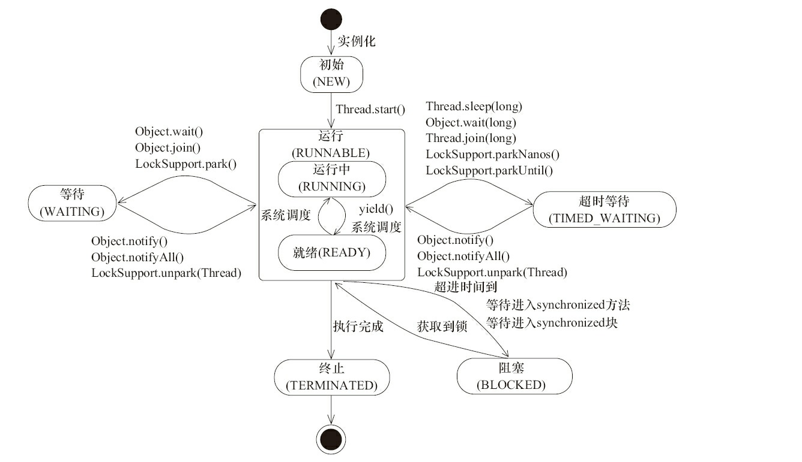

## java并发编程基础

### 1. 线程简介

线程都拥有各自的计数器、堆栈和局部变量等属性，并且能够访问共享的内存变量。

<!-- more -->

#### 线程状态：

NEW：初始状态，线程被构建，但是还没有调用`start()`方法。
RUNNABLE：运行状态，java将操作系统中的“就绪”和“运行”两种状态统称为“运行中”。此时处于`Thread.start()`方法调用之后。
处于WAITING，TIME_WAITING状态的线程在调用`Object.notify()`，`Object.notifyAll()`，`LockSupport.unpark(Thread)`方法之后，也会进入RUNNABLE状态。
BLOCKED：阻塞状态，表示线程阻塞于锁。此时线程等待进入`synchronized`代码块或方法。获取到锁后进入RUNNABLE状态。
WAITING：等待状态，进入该状态表示当前线程需要其他线程做出一些特定的动作（通知或中断），此时处于`Object.wait()`，`Object.join()`或`LockSupport.park()`方法调用之后。
TIME_WAITING：超时等待状态，它与WAITING不同，它可以在指定的时间自行返回。此时处于`Thread.sleep(long)`，`Object.wait(long)`，
`Thread.join(long)`，`LockSupport.parkNanos()`，`LockSupport.parkUntil()`方法调用之后。
TERMINATED：终止状态，表示线程已经执行完毕。


### 2. 启动和终止线程

*待完成*

### 3. 线程间通信

#### 等待通知范式

* 等待方遵循的原则：
1. “线程”获取对象的锁。
2. 如果条件不满足则调用对象的wait()方法，被通知后仍要检查条件。
3. 条件满足则执行对应的逻辑。
代码：
```
synchronized(对象) {
	while(条件不满足) {
		对象.wait();
	}
	处理对应的逻辑
}
```

* 通知方遵循的原则：
1. “线程”获取对象的锁。
2. 改变条件。
3. 通知所有等待在对象上的线程。
代码：
```
synchronized(对象){
	改变条件
	对象.notifyAll();
}
```
#### Thread.join的原理解释：
```
//场景：
main() {
	thread.join();
}
```

```
//解释：
// 加锁当前线程对象。
//此时的“对象”锁是thread。相当于范式中的“synchronized(对象)”
public final synchronized void join() throws InterruptedException {
	// 条件不满足，继续等待
	while (isAlive()) {
		//thread调用自身的wait方法。
		//相当于范式中“对象.wait()”。所以此时等待的是“main线程'对象'”。
		wait(0);
	}
	// 条件符合，方法返回
}
```

### 4. 线程应用实例