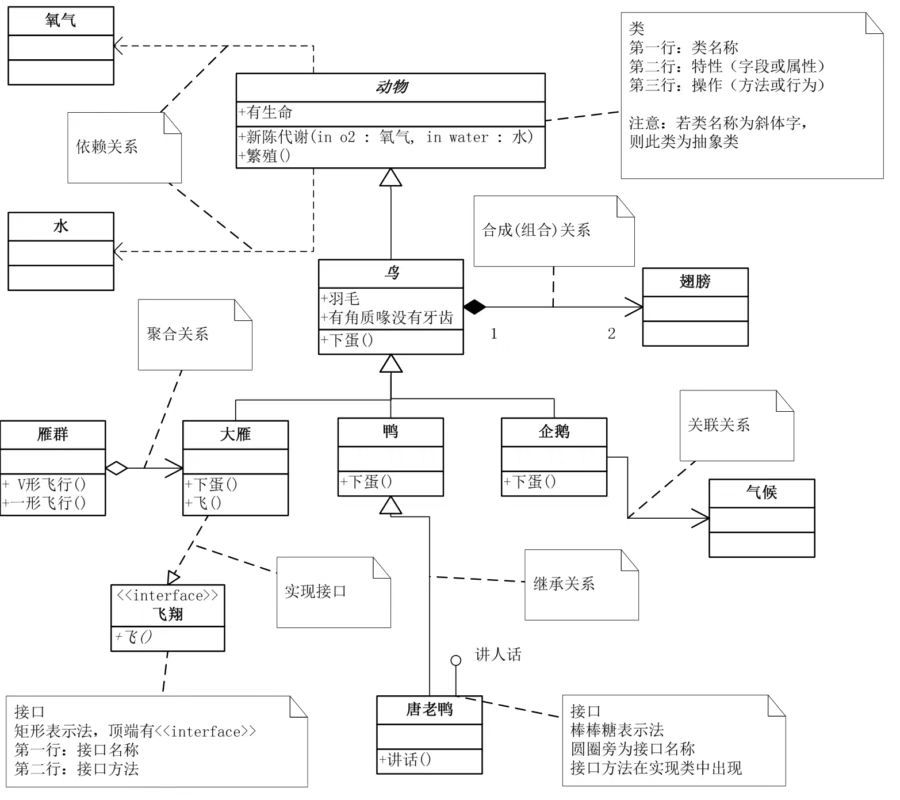

设计模式是软件界总结出来的一套可以重复使用的经验，它可以提高代码的可重用性，增强系统的可维护性，以及解决一些列复杂的问题。

<!-- more -->

### 预备知识

开发人员面对需求的变更，设计模式给了我们指导。专家们首先提出了6大设计原则，6个设计原则可以衍生出设计模式的具体实现方法。

### 1，单一职责原则

就一个类而言，应该仅有一个变动它的原因。

### 2，里式替换原则

子类型必须能够替换掉它们的父类型

### 3，依赖倒置原则

1，模块之间的依赖通过抽象发生，实现类之间不产生依赖关系，它们的依赖关系是通过接口或抽象类产生的
2，接口或抽象类不依赖实现类
3，实现类依赖接口或抽象类

### 4，接口隔离原则

接口尽量细化，同时接口中的的方法尽量少

### 5，迪米特法则

也叫最少知识原则。
如果两个类不必直接通讯，那么这两个类不应该发生直接的相互作用。如果一个类需要调用另一个类的某个方法时，可以通过第三者转发这个调用。

### 6，开闭原则

软件实体应该可以扩展，但是不可以修改。

### 1，单例模式

确保某一个类只有一个实例，而且自行实例化并向系统提供这个实例。

### 2，工厂方法模式

定义一个用于创建对象的接口，让接口的子类决定实例化哪一个类。工厂方法使一个类的实例化延迟到其子类。

### 3，抽象工厂模式

为创建每一组相关或相互依赖的对象提供一个接口，而且无需指定他们的具体类。

### 4，模板方法模式

定义一个操作中的算法的框架，而将一些步骤延迟到子类中。使得子类不需要改变一个算法的结构即可重新定义该算法的某些特定步骤。

### 5，建造者模式

将对象的创建和表示分离，使得同样的创建过程可以产生不同的表示。

### 6，代理模式

为其他对象提供一个代理以控制对这个对象的访问。

### 7，原型模式

用原型实例指定创建对象的种类，并且通过拷贝这些原型创建新的对象。

### 8，中介者模式

通过一个中介对象封装多个对象之间的交互，中介对象使各对象不需要显式的相互作用，从而使耦合松散，而且可以独立的改变它们之间的交互。

### 9，命令模式

将一个请求封装成一个对象，从而是你可以用不同请求将客户参数化，对请求排队或记录请求日志，可以提供命令的撤销和恢复功能。

### 10，责任链模式

使多个对象都有机会处理请求，从而避免了请求的发送者和接收者的耦合关系。将对象练成一条链，并沿着这条链传递该请求，知道有对象成处理它为止。

### 11，装饰模式

动态的给一个对象添加额外的职责，就增加功能来说，装饰模式比生成子类更加灵活。

### 12，策略模式

定义一组算法，将每个算法都封装起来，并且使它们之间可以互换。

### 13，适配器模式

将一个类的接口转换成客户端所需要的另一种接口，使两个因为接口不匹配而无法在一起工作的两个类能够一起工作。

### 14，迭代器模式

它提供一个方法访问容器对象的每个元素，并且不需要暴露这个对象的内部细节。

### 15，观察者模式

定义对象之间的一种一对多的依赖关系，使得当一个对象改变状态，则所有依赖它的对象都会得到通知并被自动更新。

### 16，门面模式

要求一个子系统的外部和内部的通信必须经过一个统一的对象进行，门面模式提供一个高层次的接口，使得子系统更易于使用。

### 17，备忘录模式

在不破坏封装性的前提下，捕获一个对象的内部状态，并在对象外部保存保存这个状态。这样可以将对象恢复到原先保存的状态。

### 18，访问者模式

封装一些作用于某些数据结构中的各元素的操作，它可以在不改变数据结构的前提下定义作用于这些元素的新的操作。

### 19，状态模式

当一个对象内在状态改变时允许其改变行为，这个对象看起来像改变了其类。

### 20，解释器模式

给定一门语言，定义他的语法的一种表示，并定义一个解释器，该解释器用该表示来解释语言中的句子。

### 21，享元模式

使用共享对象可以有效的支持大量的细粒度的对象。

### 22，桥梁模式

将实现和抽象解耦，使得两者可以独立的变化。

### 23，组合模式

将对象组合成树形结构以表示“部分-整体”的层次结构，使得用户对单个对象和组合对象的使用具有一致性。

