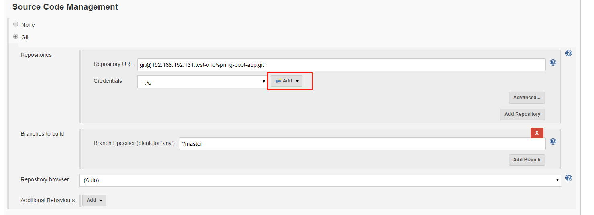
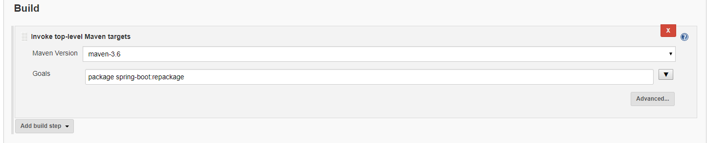
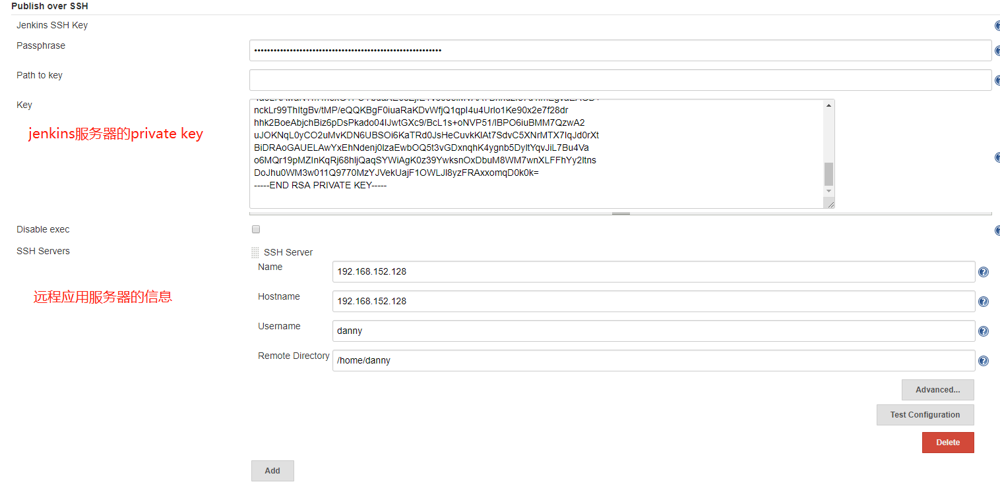
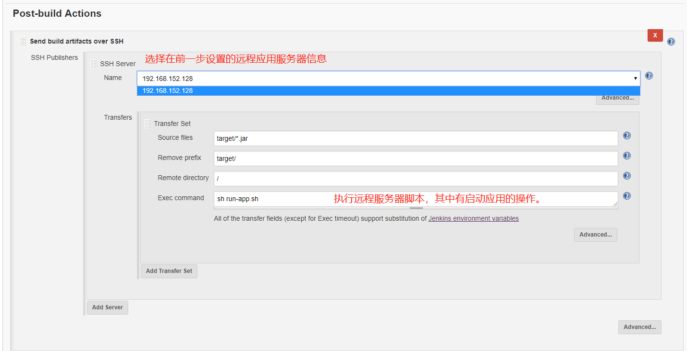

本例中Jenkins服务器和gitlab的地址都是192.168.152.131；应用服务器地址是192.168.152.128.

主要可以分为一下几个步骤：

<!-- more -->

## 1，配置代码仓库
这一步用于拉取源代码

下面是配置gitlab的访问权限，其中的private key是Jenkins服务器的。

下面还要在gitlab中配置Jenkins服务器的public key。

## 2，配置Build 
这一步用于编译并构建代码，构建方式取决于构建工具。

## 3，配置Post-build Actions
这一步用于运行构建后的应用；这里使用的是Publish Over SSH插件，该插件需要自己下载安装，它可以将构建后的文件发送到远程的应用服务器上，并且还能执行远程服务器上的脚本。
当然这一步也可以选择其他的插件，比如：SSH plugin，但是它只能执行远程服务器脚本。

安装完插件后，首先需要在Configure System中配置以下信息；其中的ssh server可能会连接失败，那么需要在Jenkins服务器上执行一个命令：`ssh-copy-id danny@192.168.152.128`。

下面是配置构建后的操作
