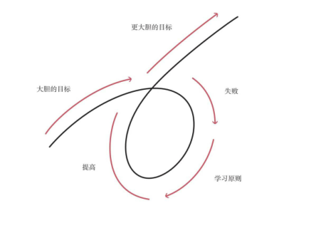
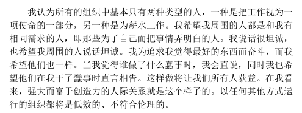
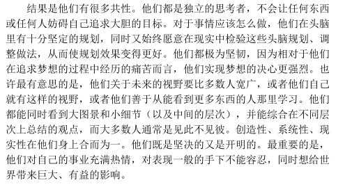
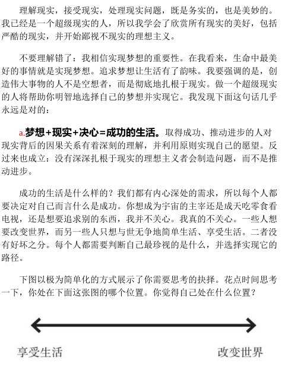
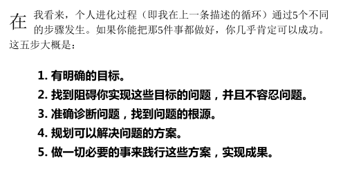
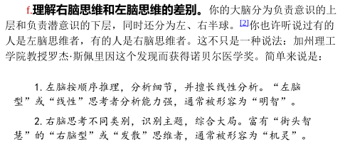

因为一段名字叫做《经济是怎么运行的》30分钟的经济知识讲解类视频，从而知道了瑞·达利欧这个人。后来关注了他的微博，了解到他写了一本叫做《原则》的书，可能那个视频就是为他的书做宣传而做的吧。
前两天在网上看到了这本书的PDF，所以就想看一下，并记录下来自己读到的一些片段和体会。

<!-- more -->

#### 第一条原则
独立思考并将决定：
1. 你想要什么
2. 事实是什么
3. 面对事实，你怎样实现自己的愿望。

#### 原则是如何总结出来的

#### 找到一种方法，克服顽固难治的问题
1. 找到与我观点不同的聪明人，以便自己能够努力理解他们的推理。
2. 知道自己在什时候不能有明确的意见，不急于下结论。
3. 逐步归纳永恒和普适的原则，对其进行测试，将其系统化。
4. 通过平衡风险保持较大的回报，并降低下行波动。
这一经历引导达利欧将桥水打造成一个创意择优的机构；不是专制机构，也不是民主机构。

#### 故事1
从1982年底开始，在接下来的18年里，美国经济经历了一段史上最繁荣的无通胀增长时期。
达利欧分析了原因：
1. 资金从借债国回流到美国，使美元升值，给美国经济造成了通缩压力，从而可以使美联储可以在不加剧通胀的情况下降息。
2. 美联储借给了银行现金，同时国际金融组织重新做出了安排，使债务国能够以举借新债的方式履行还款义务，这相当于所有人都认为一切都是良好的，然后在接下来的许多年里逐渐的减少不良债务。

#### 坦诚相待

#### 塑造者

#### 认识现实

#### 5步流程实现人生愿望

#### 人与人大不相同
