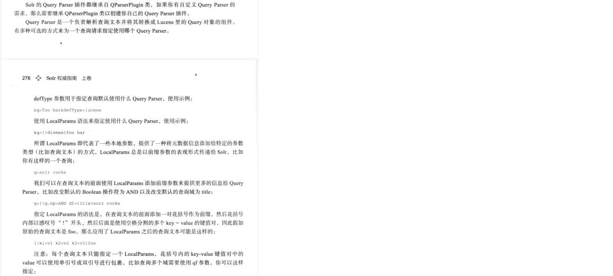
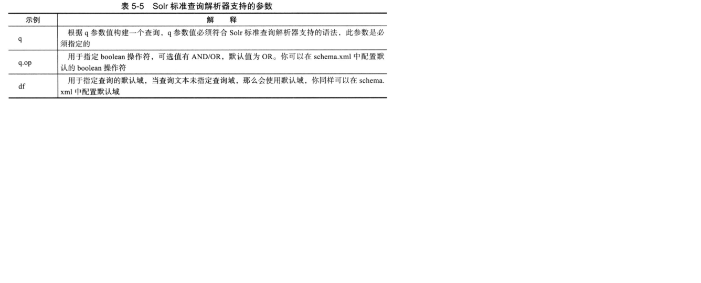

## 1，配置

### 手动创建core
core的目录结构和相关配置文件的位置是特定的。
solr启动时会扫描solr_home文件的带有core.properties文件的子目录。
具体形式可以参考以下结构：

<!-- more -->

```
E:\PROGRAM FILES\SOLR-7.5.0	//solr的install目录
└─server
    ├─solr
    │  │  README.md	//从此文件中可知：该目录是默认的solr_home。solr_home也可以自定义为其他的目录
    │  │  solr.xml
    │  │  zoo.cfg
    │  │      
    │  └─news-core	//自定义的core。以下是core的配置文件
    │      │  core.properties	//定义core的基本信息。
    │      │  
    │      ├─conf
    │      │  │  managed-schema	//定义core相关Field，只能用Schema API更改其内容；与sheme.xml文件功能相同。
    │      │  │  params.json
    │      │  │  protwords.txt
    │      │  │  solrconfig.xml
    │      │  │  stopwords.txt
    │      │  │  synonyms.txt
    │      │  │  
    │      │  └─lang
    │      │          contractions_ca.txt
    │      │          ......
    │      │          userdict_ja.txt
    │      │          
    │      └─data
    │          ├─index
    │          │      ......
    │                  
    ├─......

```

## 2，索引

### 方式1：
使用Request Handler
```
curl http://localhost:8983/solr/news-core/update -H "Content-Type: text/xml" --data-binary '
<add>
	<doc>
		<field name="id">1</field>
		<field name="title">安倍晋三本周会晤特朗普 将强调日本对美国益处</field>
		<field name="content">日本首相安倍晋三计划2月10日在华盛顿与美国总统特朗普举行会晤时提出加大日本在美国投资的设想</field>
		<field name="reply">672</field>
	</doc>
</add>'
```
### 还可以用其他方式，例如：Data Import Handler，SolrJ等。

## 3，查询

### 查询语法解析器

#### Standard Query Parser
继承自Lucene的Query Parser。
Lucene Query Parser的语法形式是：Field name:"Term+操作符"。不指定Field name时，会用Default Field。
Solr Standard Query Parser适用的查询（Request Handler接收）参数：

#### DisMax Query Parser
是Lucene Query Parser语法的一个子集。
适用的查询参数除了上面的通用参数、高亮参数、facet参数之外，还包括以下参数：

#### Extended DisMax Query Parser
它除了支持Lucene Query Parser的所有参数、DisMax Query Parser的所有参数外，还支持其他参数。