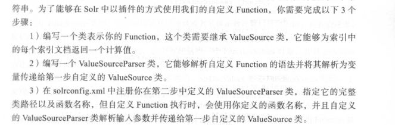

## 1，配置

### 手动创建core
core的目录结构和相关配置文件的位置是特定的。
solr启动时会扫描solr_home文件的带有core.properties文件的子目录。
具体形式可以参考以下结构：

<!-- more -->

```
E:\PROGRAM FILES\SOLR-7.5.0	//solr的install目录
└─server
    ├─solr
    │  │  README.md	//从此文件中可知：该目录是默认的solr_home。solr_home也可以自定义为其他的目录
    │  │  solr.xml
    │  │  zoo.cfg
    │  │      
    │  └─news-core	//自定义的core。以下是core的配置文件
    │      │  core.properties	//定义core的基本信息。
    │      │  
    │      ├─conf
    │      │  │  managed-schema	//定义core相关Field，只能用Schema API更改其内容；与sheme.xml文件功能相同。
    │      │  │  params.json
    │      │  │  protwords.txt
    │      │  │  solrconfig.xml
    │      │  │  stopwords.txt
    │      │  │  synonyms.txt
    │      │  │  
    │      │  └─lang
    │      │          contractions_ca.txt
    │      │          ......
    │      │          userdict_ja.txt
    │      │          
    │      └─data
    │          ├─index
    │          │      ......
    │                  
    ├─......

```

## 2，索引

### 方式1：
使用Request Handler
```
curl http://localhost:8983/solr/news-core/update -H "Content-Type: text/xml" --data-binary '
<add>
	<doc>
		<field name="id">1</field>
		<field name="title">安倍晋三本周会晤特朗普 将强调日本对美国益处</field>
		<field name="content">日本首相安倍晋三计划2月10日在华盛顿与美国总统特朗普举行会晤时提出加大日本在美国投资的设想</field>
		<field name="reply">672</field>
	</doc>
</add>'
```
### 还可以用其他方式，例如：Data Import Handler，SolrJ等。

## 3，查询

### 查询语法解析器

指定Query Parser的方式有两种
1. 用defType参数指定；例如：

`&q=title:美国&defType=dismax`

2. 用Local Parameters语法指定；例如：

`&q={!dismax df=content}日本`

#### Local Parameters—本地参数

本地参数可以为查询字符串添加前缀，目的是为Query Parser提供更多的元数据信息。
基本语法是：
`{!k=v [k=v]...}`

1. Note 1：
当只有value没有key时，本地参数会默认给一个key，即“type”；这种用法是在指定某个Query Parser。

2. Note 2：
本地参数中有个特殊的key，即“v”，它可以为查询参数指定值。

3. Note 3：
本地参数中可以用$符号引用别的参数的值。

4. Note 4：
下面语句的意思是：定义了一个Filter Query；Query中指定的Query Parser是Function Range Query Parser；
该Query Parser是用来解析后面的if()函数的，并限制if函数的返回值的范围最大为1；
if()函数的第一个参数是一个gt()函数—比较reply的值大于700的结果。
`&fq={!frange l=1}if(gt(reply,700),1,0)`


#### Common Query Parameters
通用查询参数：


#### Standard Query Parser

继承自Lucene的Query Parser。
Lucene Query Parser的语法形式是：Field name:"Term+操作符"。

> 细节：

```
不指定Field name时，会用Default Field。
Term分两种:
1，单个Term。例如hello、你、好、"hello"、"test"等单个单词。
2，Phrase短语。它是两头被引号包裹的一组单词。例如："Hello World"、"你好"、"欢迎回来"。
```
Solr Standard Query Parser适用的查询参数（Request Handler接收）：


#### DisMax Query Parser

是Lucene Query Parser语法的一个子集。
适用的查询参数除了上面的通用参数、高亮参数、facet参数之外，还包括以下参数：


#### Extended DisMax Query Parser

它除了支持Lucene Query Parser的所有参数、DisMax Query Parser的所有参数外，还支持其他参数。

## 4，Facet—维度查询

Facet可以基于索引文档的某个维度或方面，对查询匹配的索引文档进行分类。
可以看做是高级版的Group。

当执行一个Field Facet查询时，它会返回对应的域上，每一个唯一域值的列表以及每一个唯一域值匹配到的文档的总数。
当执行一个Query Facet查询时，它会返回对应的子查询上，每一个唯一子查询的列表以及每一个子查询匹配到的文档的总数。

示例：
```
q=*:*&
	facet=on&	//开启Facet查询
	fq=reply:[600 TO 800]&	//查询并过滤reply域的值在600至800之间的文档
	facet.limit=4&			//限制内个facet组只返回前4项（term）
	facet.field=content&	//在指定的content域上执行Facet查询，在Facet查询中，会对该域的域值进行分组统计。
	facet.field=reply&		//指定了reply域，意义同上。
	facet.query=content:"日本"& //在指定的子查询：“content:日本”上执行Facet查询，在Facet查询中，会对子查询的结果进行分组统计。
	facet.query=content:"美国"	//意义同上。
```

## 5，Highlighting—高亮查询

```
q=blue fireball in the rain&	//查询项
	df=sighting_en&				//应用的default field。
	wt=json&					//
	hl=true&					//开启high lighting。
	hl.snippets=2&				//每个查询到的索引文档，最多返回2个片段
	hl.fl=sighting_en&			//为sighting_en field应用高亮。
	hl.q=blue fireball in the rain light& //在高亮结果中增加一个q查询之外的 “light” term。
	fq=shape_s:light			//filter query项。
```

## 7，Group—分组查询

### Grouping Results by Field

根据Field对查询结果分组。

```
q=*:*&							//查询所有项。
	sort=popularity asc&		//根据popularity排序。
	fl=id,type,product,format&	//查询结果中返回的field list。
	group=true&					//对查询结果分组。
	group.field=product&		//根据product field对查询结果进行分组。
	group.main=true				//合并每个分组的结果，在response的“docs”下显示。
```

### Grouping by Query

根据子查询对结果分组。
示例：

```
q=*:*&							//查询所有项。
	sort=popularity asc&		//根据popularity排序。
	fl=id,type,product,format&	//查询结果中返回的field list。
	group=true&					//对查询结果分组。
	group.limit=2&				//每组返回2个结果。等于-1时表示每组中返回所有结果。
	group.query="The Hunger Games"&	//返回每个子查询及结果，并对子查询的结果分组
	group.query=games&				//同上。
	group.query=type:Movies			//同上。
```

### Collapsing Query Parser

它的作用是：每个field组下面的唯一term值，只返回一个索引文档
语法：`q=*:*&fq={!collapse field=product}`
group与它不同的是：
group返回的是每个field组下面的所有匹配的索引文档，并且可以通过"group.limit"参数来控制返回1个、多个或者所有个。

## 8，函数查询

### 语法：

`functionName(input1,[ ..., inputN])`
input参数可以是以下任意一种形式：
1. 一个常量值：100、1.45、"hello world"
2. 一个域名称：fieldName、field(fieldName)
3. 一个function：functionName(...)
4. 一个变量：q={!func}min($f1,$f2)&f1=sqrt(popularity)&f2=1

一些特殊的语法：
1. Constant Function的语法是值本身。
2. Field Function的语法是域的名称被一个名称为“field”的函数包裹。
3. Parameter Substitution（替换变量）的语法是函数的输入变量是一个$开头的变量，该变量引用自请求URL中查询文本定义的变量。

### 使用形式：
有多种：
1. 对q参数加权；`q=solr AND _val_:"recip(ms(date),1,100,100)"`
2. 在不同Query Parser中使用；在eDisMax Query Parser中通过bf参数指定function， `q=dismax&bf="ord(popularity)^0.5 recip(rord(price),1,1000,1000)^0.3"`
3. 通过本地参数!func来构造一个Function Query；`q=solr AND {!func v ="add(l,boostField)"}`

### Function Range Query Parser（简称frange）
可以根据函数计算值的范围来过滤索引文档。
```
q=*:*&
	fq={!frange l=10 u=15}product(basePrice,sum(1,$userSalseTax))&	//l表示lower最小值，u表示upper最大值。
	userSalseTax=0.07
```

### 自定义函数：


## 9，SolrCloud

### 搭建

#### zookeeper搭建
参考：
> https://blog.csdn.net/Thinking_one/article/details/89280227

#### solr配置
```shell
#配置该环境变量会让solr以cloud的方式运行
export ZK_HOST=192.168.0.201:2181,192.168.0.202:2181,192.168.0.203:2181

#下载solr到指定目录
wget -q 'http://apache.mirrors.hoobly.com/lucene/solr/6.5.1/solr-6.5.1.tgz' -P /root/

#解压出来安装脚本
tar xzf /root/solr-6.5.1.tgz, solr-6.5.1/bin/install_solr_service.sh '--strip-components=2'

#安装solr，安装后会自动运行
bash install_solr_service.sh /root/solr-6.5.1.tgz

#停止solr
service solr stop

#改变solr运行目录所属用户
chown -R "danny:danny" /opt/solr-6.5.1
chown -R "danny:danny" /opt/solr

#重启solr
service solr start

#切换到用户danny的环境下创建collection
su -c "/opt/solr/bin/solr create_collection \	#运行solr命令
							-c products \	#创建collection的名称
							-d /opt/myapp/configuration/solr/products/conf/ \	#collection需要的配置文件的目录，主要是schema.xml和solrconfig.xml文件，该文件需要提前编写。
							-shards 4 \	#指定当前collection的shard数量
							-replicationFactor 1 \	#指定每个shard划分replica的数量
							-n products-conf" \	#指定配置文件目录在zookeeper中的名称。
												#默认-d参数下的所有配置文件会上传到zookeeper中，
												#且以collection的名称（即-c的参数）作为配置文件目录在zookeeper中名称。
							- danny	#切换到指定用户下执行

#显示的将一个collection与指定的配置文件目录进行绑定
sh /opt/solr/server/scripts/cloud-scripts/zkcli.sh \
										-zkhost 192.168.0.19 \
										-cmd linkconfig \
										-collection products \
										-confname products-conf

#创建core
curl "http://localhost:8983/solr/admin/cores?action=CREATE&name=products&collection=products"
										
```

### SolrCloud的核心概念

#### 1，物理概念
1. 节点（Node）：运行solr服务的单个实例。
2. 核心（Core）：是用来承载Document的，可以理解为多个Document的集合；一个节点可以有多个核心。
3. 副本（Replica）：是某一个具体的核心的副本，可以存在于同一个节点上，也可以存在于集群中的其他节点上。

#### 2，逻辑概念
4. 分片（Shard）：一组的核心的副本。处理向核心发送的添加、同步、查询等任何请求。
5. 集合（Collection）：集群中的一组分片。
6. 集群（Cluster）：在solr实例和solr cloud中配置的多个活动的集合。

### 索引文档路由
创建索引时的两种使用方式：
1. 指定router.name参数来设置文档路由。
2. 默认使用自动路由（compositeID），可以创建并发送一个document id带有前缀的索引文档；形式是：“前缀!真实的document id”，例如：“IBM!123”（也叫自定义散列）。
搜索时：使用_route_参数指定前缀字符。

> 它的作用是，通过计算前缀的hash值，来确定该索引文档发送到那个shard，这样前缀相同的文档就会发送到相同的shard，从而也可以实现group和join查询。
> 查询时可以指定Shard，避免了在所有Shard之间查询的网络延迟，提高查询效率。

### 确定Shard Leader
Shard Leader负责接收更新请求，并将这些请求协调分配给各个副本。

### SolrCloud分布式索引
solrCloud中分布式索引的总体步骤是：能够将文档发送到集群中的各个节点，并且能够在正确的分片中被索引。

#### 1，将文档分配给分片
索引文档时需要将文档分配给其中一个分片，并且一个文档只能分配给每个集群中的一个分片。
Solr使用`文档路由器`组件来确定文档被分配到那个分片。
SolrCloud有两种路由策略：
1. compositeID（默认）。
我们知道，创建Collection时必须指定Shard的数量。确定Shard的数量后，Solr会给每个Shard分配一个`32位的散列值`。
例如，创建Collection时，指定了2个Shard；则分配给shard1的散列区间是80000000-ffffffff，分配给shard2的散列区间是0-7fffffff（16进制值）。
Solr会在每个分片之间均分这个32位的散列值。
`compositeID路由器`会计算出文档中唯一ID字段的数值散列值；然后Solr会将文档分配给散列值区间包含`文档的散列值`的Shared上，用的算法是MurmurHash算法。

2. 隐式路由。

#### 2，添加文档的步骤：
1. 使用solrJ的CloudSolrServer发送更新请求。CloudSolrServer连接zookeeper以获取集群的当前状态；也知道哪些节点是分片代表；它也提供了基本的负载均衡和客户端重试逻辑。
2. 将文档分配给正确的分片。CloudSolrServer需要使用文档路由进程来确定将文档发送到哪个分片上。
3. 代表分配版本ID号。在将文档发送给副本之前，分片代表会本地索引文档；代表会给每一个新文档分配一个版本号。
4. 将请求转发给副本。
5. 确认写操作成功。

#### 3，节点恢复
SolrCloud能妥善的处理脱机节点，他提供了两种基本的恢复方案：
1. 对等同步
2. 快照复制
这也表示可以在任何时间内将副本添加到集群中，因为它能自己从分片代表获取完整的索引。

### SolrCloud分布式查询
查询集合中的所有分片并创建统一结果集的过程称为分布式查询。

#### 1，查询流程
分布式查询过程中，solr需要将各个分片的结果汇总，然后将其合并为单个结果，最后响应给客户端。
1. 客户端将查询请求发送到任何节点。
2. 查询控制器接受请求。
3. 查询。查询控制器会给每个分片发送一个非分布式查询；被发送给每个分片的查询式只请求id和score字段，不会过早读取所有存储字段，只有等到最后正确的文档被确认，才读取需要的文档中的存储字段。
4. 读取字段。当上一步的查询确认了匹配的文档，查询控制器才会把第二步查询发送给节点的子集，以便得到满足请求的其他字段；如果请求需要的仅仅是ID字段，则不会发送第二步查询；另外，只有包含需要返回的文档的分片，才会接收第二步查询。

#### 2，查询的局限性
1. 按权重对文档排序时，会出现偏差。因为计算权重只用到了本地索引中的词频。
2. 连接（join）在分布式环境下不起作用。除非使用`自定义散列`。
3. 为了使用分组（group）功能，需要使用`自定义散列`去分配那些需要被分到同组的文档。