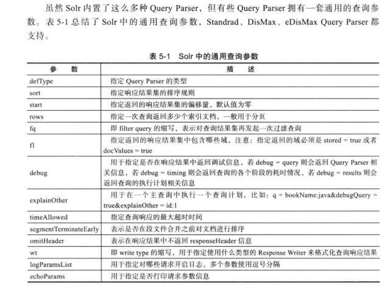
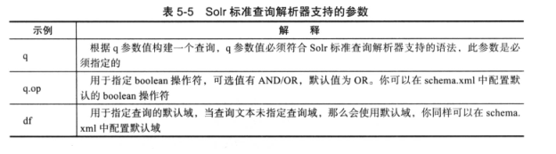
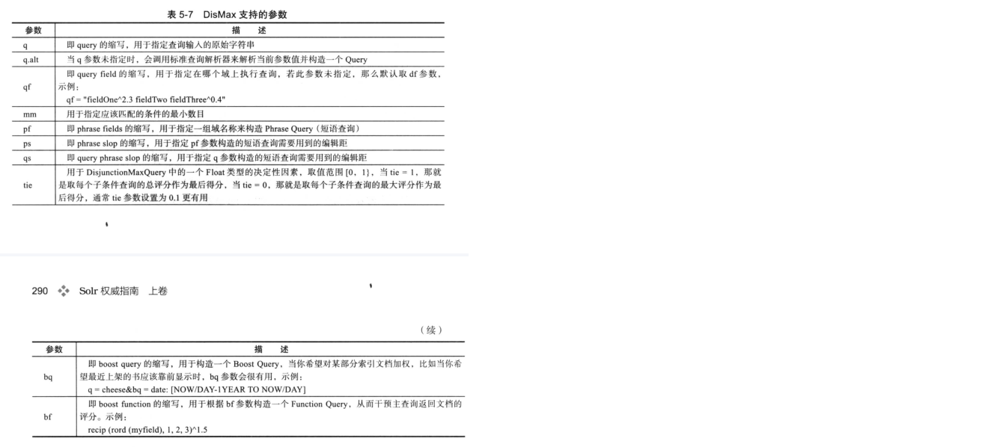

## 1，配置

### 手动创建core
core的目录结构和相关配置文件的位置是特定的。
solr启动时会扫描solr_home文件的带有core.properties文件的子目录。
具体形式可以参考以下结构：

<!-- more -->

```
E:\PROGRAM FILES\SOLR-7.5.0	//solr的install目录
└─server
    ├─solr
    │  │  README.md	//从此文件中可知：该目录是默认的solr_home。solr_home也可以自定义为其他的目录
    │  │  solr.xml
    │  │  zoo.cfg
    │  │      
    │  └─news-core	//自定义的core。以下是core的配置文件
    │      │  core.properties	//定义core的基本信息。
    │      │  
    │      ├─conf
    │      │  │  managed-schema	//定义core相关Field，只能用Schema API更改其内容；与sheme.xml文件功能相同。
    │      │  │  params.json
    │      │  │  protwords.txt
    │      │  │  solrconfig.xml
    │      │  │  stopwords.txt
    │      │  │  synonyms.txt
    │      │  │  
    │      │  └─lang
    │      │          contractions_ca.txt
    │      │          ......
    │      │          userdict_ja.txt
    │      │          
    │      └─data
    │          ├─index
    │          │      ......
    │                  
    ├─......

```

## 2，索引

### 方式1：
使用Request Handler
```
curl http://localhost:8983/solr/news-core/update -H "Content-Type: text/xml" --data-binary '
<add>
	<doc>
		<field name="id">1</field>
		<field name="title">安倍晋三本周会晤特朗普 将强调日本对美国益处</field>
		<field name="content">日本首相安倍晋三计划2月10日在华盛顿与美国总统特朗普举行会晤时提出加大日本在美国投资的设想</field>
		<field name="reply">672</field>
	</doc>
</add>'
```
### 还可以用其他方式，例如：Data Import Handler，SolrJ等。

## 3，查询

### 查询语法解析器

指定Query Parser的方式有两种
1. 用defType参数指定；例如：

`&q=title:美国&defType=dismax`

2. 用Local Parameters语法指定；例如：

`&q={!dismax df=content}日本`

#### Local Parameters—本地参数

本地参数可以为查询字符串添加前缀，目的是为Query Parser提供更多的元数据信息。
基本语法是：
`{!k=v [k=v]...}`

1. Note 1：
当只有value没有key时，本地参数会默认给一个key-“type”；这种用法是在指定某个Query Parser。

2. Note 2：
本地参数中有个特殊的key—“v”，它可以为查询参数指定值。

3. Note 3：
本地参数中可以用$符号引用别的参数的值。

4. Note 4：
下面语句的意思是：定义了一个Filter Query；Query中指定的Query Parser是Function Range Query Parser；
该Query Parser是用来解析后面的if()函数的，并限制if函数的返回值的范围最大为1；
if()函数的第一个参数是一个gt()函数—比较reply的值大于700的结果。
`&fq={!frange l=1}if(gt(reply,700),1,0)`


#### Common Query Parameters
通用查询参数：



#### Standard Query Parser

继承自Lucene的Query Parser。
Lucene Query Parser的语法形式是：Field name:"Term+操作符"。

> 细节：

```
不指定Field name时，会用Default Field。
Term分两种:
1，单个Term。例如hello、你、好、"hello"、"test"等单个单词。
2，Phrase短语。它是两头被引号包裹的一组单词。例如："Hello World"、"你好"、"欢迎回来"。
```
Solr Standard Query Parser适用的查询参数（Request Handler接收）：


#### DisMax Query Parser

是Lucene Query Parser语法的一个子集。
适用的查询参数除了上面的通用参数、高亮参数、facet参数之外，还包括以下参数：


#### Extended DisMax Query Parser

它除了支持Lucene Query Parser的所有参数、DisMax Query Parser的所有参数外，还支持其他参数。

## 4，Facet—维度查询

Facet可以基于索引文档的某个维度或方面，对查询匹配的索引文档进行分类。
可以看做是高级版的Group。

当执行一个Field Facet查询时，它会返回对应的域上，每一个唯一域值的列表以及每一个唯一域值匹配到的文档的总数。
当执行一个Query Facet查询时，它会返回对应的子查询上，每一个唯一子查询的列表以及每一个子查询匹配到的文档的总数。

示例：
```
q=*:*&
	facet=on&	//开启Facet查询
	fq=reply:[600 TO 800]&	//查询并过滤reply域的值在600至800之间的文档
	facet.limit=4&			//限制内个facet组只返回前4项（term）
	facet.field=content&	//在指定的content域上执行Facet查询，在Facet查询中，会对该域的域值进行分组统计。
	facet.field=reply&		//指定了reply域，意义同上。
	facet.query=content:"日本"& //在指定的子查询：“content:日本”上执行Facet查询，在Facet查询中，会对子查询的结果进行分组统计。
	facet.query=content:"美国"	//意义同上。
```

## 5，Highlighting—高亮查询

```
q=blue fireball in the rain&	//查询项
	df=sighting_en&				//应用的default field。
	wt=json&					//
	hl=true&					//开启high lighting。
	hl.snippets=2&				//每个查询到的索引文档，最多返回2个片段
	hl.fl=sighting_en&			//为sighting_en field应用高亮。
	hl.q=blue fireball in the rain light& //在高亮结果中增加一个q查询之外的 “light” term。
	fq=shape_s:light			//filter query项。
```

## 7，Group—分组查询

### Grouping Results by Field

根据Field对查询结果分组。

```
q=*:*&							//查询所有项。
	sort=popularity asc&		//根据popularity排序。
	fl=id,type,product,format&	//查询结果中返回的field list。
	group=true&					//对查询结果分组。
	group.field=product&		//根据product field对查询结果进行分组。
	group.main=true				//合并每个分组的结果，在response的“docs”下显示。
```

### Grouping by Query

根据子查询对结果分组。
示例：

```
q=*:*&							//查询所有项。
	sort=popularity asc&		//根据popularity排序。
	fl=id,type,product,format&	//查询结果中返回的field list。
	group=true&					//对查询结果分组。
	group.limit=2&				//每组返回2个结果。等于-1时表示每组中返回所有结果。
	group.query="The Hunger Games"&	//返回每个子查询及结果，并对子查询的结果分组
	group.query=games&				//同上。
	group.query=type:Movies			//同上。
```

### Collapsing Query Parser

它的作用是：每个field组下面的唯一term值，只返回一个索引文档
语法：`q=*:*&fq={!collapse field=product}`
group与它不同的是：
group返回的是每个field组下面的所有匹配的索引文档，并且可以通过"group.limit"参数来控制返回1个、多个或者所有个。

## 8，函数查询

### 语法：

`functionName(input1,[ ..., inputN])`


### 使用形式：

### 自定义函数：

## 9，SolrCloud

### 搭建
