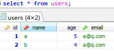
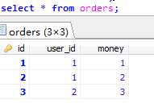
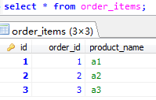
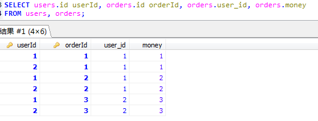
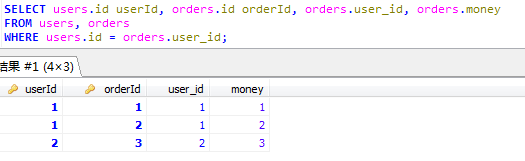
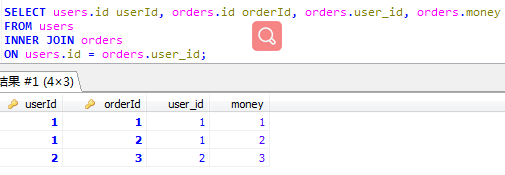
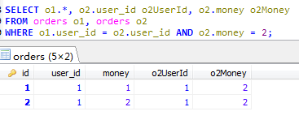

联结查询是关系型数据库中对多个关系表进行操作的重要功能。联结的方式可以分为以下几种。

<!-- more -->
涉及到的表结构：
1. user表

2. orders表

3. order_items表

#### 默认的联结查询（包括各种联结）

第一个表中的每一行将与第二个表中的每一行配对。
这时返回的结果集被称为`笛卡尔积`；即检索出的行数等于第一个表中的行数乘以第二个表中的行数；也称为`叉联结（cross join）`。

#### 等值联结

通常情况下，联结查询都需要联结条件-`where语句`；这样才能过滤出正确的两个关系表中的数据。

#### 内联结

它是等值联结的`标准语法`；等同于等值联结。

*如果从表中有主表的重复的关联值，则查询主表时，会重复出现主表中的数据*
*例如查询uses时，由于orders中有重复的users的ID，所以查询时会有重复的users的数据*

#### 自联结

用于同一个表的联结查询，需要用到表的别名。
上面语句的意思是找到订单额是2的用户的所有订单；SQL的执行顺序是from语句组成笛卡尔积，where语句从左到右过滤出需要的数据。

#### 自然联结

#### 外联结
用于查询在相关表中没有关联行的行。
通常情况下，联结查询都需要联结条件-`on语句`；这样才能过滤出正确的两个关系表中的数据。

#### 全外联结
MySQL不支持